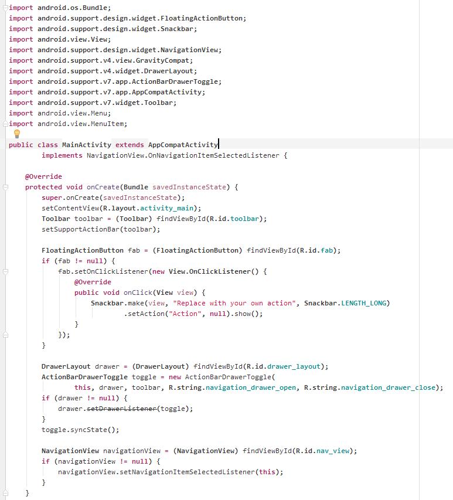
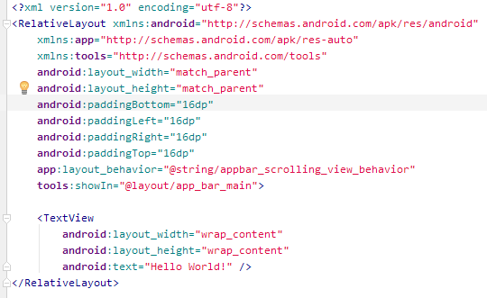

# GitHubTheme2016

An Android Studio 2.1 / JetBrains IntelliJ IDEA color scheme inspired by GitHub

## Installation instructions:

1. Download the .icls file into your "<UserFolder>\.AndroidStudio<version>\config\colors" folder.
2. (Re)start Android Studio / IntelliJ IDEA.
3. Go into File -> Settings -> Editor -> General -> Colors & Fonts
4. Choose from the "Scheme" dropdown menu: GitHub 2016

## How the Java code looks like:

## How the XML code looks like:

